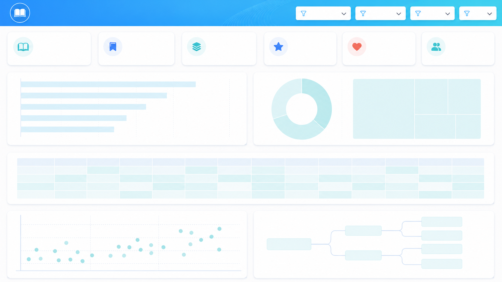
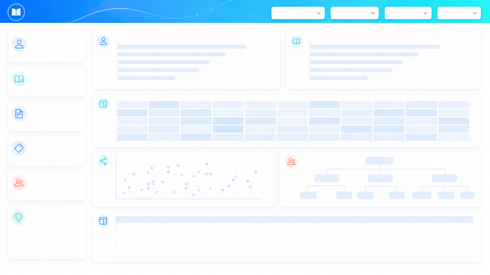

# End-to-End Book Data Pipeline on AWS

<p align="center">
  <strong>Open Library API → Amazon S3 Data Lake → AWS Glue/PySpark → Amazon Redshift → FastAPI on Lightsail → Power BI</strong>
</p>

<p align="center">
  
  
  
  
  
  
  
  
</p>

## Tổng quan

Dự án xây dựng một **data pipeline end-to-end trên AWS** để thu thập, lưu trữ, xử lý, mô hình hóa và phân tích dữ liệu sách từ **Open Library API**.

Pipeline thực hiện toàn bộ vòng đời dữ liệu:

1. Thu thập dữ liệu `works`, `editions` và `authors` từ Open Library bằng crawler đa luồng.
2. Chuyển dữ liệu JSON lồng nhau thành Parquet nén Snappy.
3. Lưu dữ liệu thô vào Amazon S3 theo mô hình Data Lake.
4. Dùng AWS Glue và PySpark để làm sạch, chuẩn hóa và xây dựng mô hình dữ liệu phân tích.
5. Lưu các bảng dimension, fact và bridge vào vùng warehouse trên S3.
6. Nạp dữ liệu vào Amazon Redshift và đồng bộ thay đổi bằng cơ chế staging + `MERGE`.
7. Cung cấp REST API bằng FastAPI triển khai trên Amazon Lightsail.
8. Kết nối Power BI với Redshift để xây dựng dashboard và báo cáo.
9. Có thể điều phối pipeline bằng AWS Step Functions và chạy định kỳ bằng Amazon EventBridge.

## Kiến trúc hệ thống

<p align="center">
  
</p>

### Luồng dữ liệu chính

```text
Open Library API
       │
       ▼
EC2 / Python multithreaded crawler
       │  JSON → Pandas DataFrame → Parquet/Snappy
       ▼
Amazon S3: raw_data/
       │
       ├── AWS Glue Crawler → Glue Data Catalog → Amazon Athena
       │
       ▼
AWS Glue / PySpark ETL
       │  Clean, normalize, explode, map, join, model
       ▼
Amazon S3: warehouse/
       │
       ▼
Amazon Redshift
       ├── Power BI dashboards
       └── FastAPI REST API on Amazon Lightsail
                    │
                    ├── GET data
                    └── INSERT data

EventBridge → Step Functions → điều phối crawler và ETL
IAM → quản lý quyền truy cập giữa các dịch vụ
```

## Mục tiêu của dự án

- Xây dựng một kiến trúc dữ liệu có khả năng mở rộng trên AWS.
- Tách biệt rõ vùng dữ liệu thô, dữ liệu đã xử lý và data warehouse.
- Tối ưu lưu trữ và xử lý bằng định dạng Parquet cùng Snappy compression.
- Biến dữ liệu API bán cấu trúc thành mô hình phù hợp cho BI và analytics.
- Hỗ trợ truy vấn dữ liệu qua Athena, Redshift, Power BI và REST API.
- Minh họa quy trình data engineering hoàn chỉnh: ingestion, ETL, orchestration, warehouse, API và visualization.

## Chức năng nổi bật

### Data ingestion

- Thu thập dữ liệu từ Open Library theo subject.
- Crawl đồng thời dữ liệu works, editions và authors.
- Sử dụng queue và worker thread để tăng tốc xử lý.
- Có retry khi HTTP request thất bại.
- Chống trùng lặp edition và author trong quá trình chạy.
- Chuyển các object/list lồng nhau thành JSON string trước khi ghi Parquet.
- Upload trực tiếp Parquet từ bộ nhớ lên S3, không cần lưu file tạm trên máy.

### Data Lake

- Lưu dữ liệu thô theo từng domain:
  - `raw_data/works/`
  - `raw_data/editions/`
  - `raw_data/authors/`
- Dữ liệu được lưu dưới dạng Parquet và nén Snappy.
- AWS Glue Crawler có thể phát hiện schema và đăng ký bảng trong Glue Data Catalog.
- Amazon Athena có thể truy vấn trực tiếp dữ liệu trên S3.

### ETL với AWS Glue và PySpark

- Đọc nhiều Parquet object từ S3 và union schema bằng `unionByName`.
- Chuẩn hóa ID của work, edition và author.
- Xử lý null bằng median hoặc giá trị mặc định.
- Làm sạch subject, publisher, language và năm xuất bản.
- Explode dữ liệu mảng để tạo bảng dimension và bridge.
- Tạo surrogate key cho subject và time bằng window function.
- Dùng broadcast join khi tạo fact table.
- Ghi kết quả ra S3 dưới dạng Parquet/Snappy.
- Partition dimension/bridge theo ngày chạy pipeline.

### Data warehouse

Mô hình warehouse gồm:

- 5 dimension tables.
- 1 fact table.
- 2 bridge tables để xử lý quan hệ nhiều-nhiều.

### CDC vào Amazon Redshift

- Nạp Parquet mới từ S3 vào staging table.
- Dùng `MERGE` theo `edition_id`.
- Update bản ghi đã tồn tại.
- Insert bản ghi mới.

### REST API

- FastAPI kết nối trực tiếp tới Redshift.
- Xác thực bằng header `x-api-key`.
- Chỉ cho phép truy cập danh sách bảng đã khai báo.
- Kiểm tra tên bảng và cột để giảm nguy cơ SQL injection qua identifier.
- Hỗ trợ phân trang bằng `limit` và `offset`.
- Hỗ trợ đọc bảng, đếm bản ghi, insert một dòng và bulk insert.
- Có Swagger UI tự động tại `/docs`.

### Business intelligence

- File Power BI được lưu tại `dashboard/dashboard1.pbix`.
- Các layout dashboard mẫu nằm trong thư mục `dashboard/`.
- Power BI có thể truy vấn Redshift bằng Import hoặc DirectQuery tùy nhu cầu triển khai.

## Công nghệ sử dụng

| Nhóm | Công nghệ |
|---|---|
| Data source | Open Library REST API |
| Programming | Python |
| Ingestion | Requests, threading, queue, Pandas, Boto3 |
| Storage format | Apache Parquet, Snappy |
| Data Lake | Amazon S3 |
| Processing | AWS Glue, Apache Spark, PySpark |
| Metadata | AWS Glue Data Catalog |
| Ad-hoc query | Amazon Athena |
| Data warehouse | Amazon Redshift |
| CDC | Redshift staging table, COPY, MERGE |
| API | FastAPI, Pydantic, redshift-connector |
| API hosting | Amazon Lightsail |
| BI | Microsoft Power BI |
| Orchestration | AWS Step Functions, Amazon EventBridge |
| Security | AWS IAM, API key, environment variables |

## Mô hình dữ liệu

Dự án sử dụng mô hình gần với **star schema mở rộng**, kết hợp bridge tables cho các quan hệ nhiều-nhiều.

```text
                 ┌──────────────┐
                 │  dim_author  │
                 └──────┬───────┘
                        │
                 ┌──────▼───────┐
                 │ work_author  │
                 └──────┬───────┘
                        │
┌──────────────┐  ┌─────▼──────┐  ┌──────────────┐
│ dim_subject  │  │  dim_work  │  │ dim_edition  │
└──────┬───────┘  └─────┬──────┘  └──────┬───────┘
       │                │                 │
┌──────▼───────┐        │          ┌──────▼───────┐
│ work_subject │────────┘          │  fact_book   │
└──────────────┘                   └──────┬───────┘
                                        │
                                 ┌──────▼───────┐
                                 │   dim_time   │
                                 └──────────────┘
```

### `dim_work`

| Cột | Ý nghĩa |
|---|---|
| `work_id` | ID chuẩn hóa của tác phẩm |
| `title` | Tên tác phẩm |
| `first_publish_year` | Năm xuất bản đầu tiên |
| `edition_count` | Số lượng edition |

### `dim_edition`

| Cột | Ý nghĩa |
|---|---|
| `edition_id` | ID của edition |
| `title` | Tên edition |
| `publish_date` | Năm xuất bản đã chuẩn hóa |
| `publisher` | Nhà xuất bản |
| `language` | Ngôn ngữ đã ánh xạ sang tên đầy đủ |

### `dim_author`

| Cột | Ý nghĩa |
|---|---|
| `author_id` | ID tác giả |
| `name` | Tên tác giả |
| `birth_date` | Năm sinh đã chuẩn hóa |

### `dim_subject`

| Cột | Ý nghĩa |
|---|---|
| `subject_id` | Surrogate key của subject |
| `subject` | Chủ đề sách đã làm sạch |

### `dim_time`

| Cột | Ý nghĩa |
|---|---|
| `time_id` | Surrogate key của thời gian |
| `publish_year` | Năm xuất bản |
| `decade` | Thập niên |
| `century` | Thế kỷ |

### `fact_book`

| Cột | Ý nghĩa |
|---|---|
| `edition_id` | Edition được ghi nhận |
| `work_id` | Work tương ứng |
| `time_id` | Khóa tham chiếu tới `dim_time` |
| `number_of_pages` | Số trang |

### `work_author`

| Cột | Ý nghĩa |
|---|---|
| `work_id` | ID tác phẩm |
| `author_id` | ID tác giả |

### `work_subject`

| Cột | Ý nghĩa |
|---|---|
| `work_id` | ID tác phẩm |
| `subject_id` | ID chủ đề |

## Quy tắc làm sạch và biến đổi dữ liệu

### Works

- Chỉ giữ các cột cần cho analytics.
- Trích `work_id` bằng regex từ trường `key`.
- Ép `first_publish_year` sang integer.
- Điền năm xuất bản bị thiếu bằng median.
- Explode danh sách subject thành từng dòng.
- Loại subject rỗng, chứa URL, email, ký tự bất thường hoặc dữ liệu không phù hợp.
- Chuẩn hóa khoảng trắng và ký tự đặc biệt.

### Editions

- Trích `work_id` từ JSON lồng nhau.
- Trích `edition_id` từ `key`.
- Chuyển `publish_date` về năm dạng số.
- Điền `publish_date` và `number_of_pages` bị thiếu bằng median.
- Điền giá trị mặc định cho title, publisher và language.
- Explode publisher.
- Loại các chuỗi publisher không hợp lệ hoặc quá dài.
- Ánh xạ mã ngôn ngữ như `eng`, `vie`, `fre`, `jpn` sang tên đầy đủ.

### Authors

- Loại tiền tố `/authors/` khỏi ID.
- Loại author không có tên hoặc có tên không hợp lệ.
- Trích năm sinh bằng regex.

> [!NOTE]
> Code hiện tại sinh một năm ngẫu nhiên cho `birth_date` bị thiếu. Với hệ thống production, nên để `NULL`, dùng cờ `is_birth_year_imputed`, hoặc áp dụng quy tắc suy diễn có thể kiểm chứng thay vì tạo dữ liệu ngẫu nhiên.

## Cấu trúc S3 đề xuất

```text
s3://<YOUR_BUCKET>/
├── raw_data/
│   ├── works/
│   │   └── part-<timestamp>.parquet
│   ├── editions/
│   │   └── part-<timestamp>.parquet
│   └── authors/
│       └── part-<timestamp>.parquet
├── warehouse/
│   ├── dim_work/
│   ├── dim_edition/
│   ├── dim_author/
│   ├── dim_subject/
│   ├── dim_time/
│   ├── fact_book/
│   ├── work_author/
│   └── work_subject/
└── meta/
    └── subjects.txt
```

## Cấu trúc thư mục dự án

```text
.
├── README.md
├── docs/
│   └── aws-book-pipeline-architecture.png
├── scraper/
│   └── crawl.ipynb
├── clean_data/
│   ├── clean.ipynb
│   ├── clean_data.ipynb
│   └── data/
│       ├── works.parquet
│       ├── editions.parquet
│       └── authors.parquet
├── glue/
│   ├── configuration.py
│   ├── load_data.py
│   ├── clean_data.py
│   ├── elt_data.py
│   ├── orchestration.py
│   └── main.py
├── glue_libs.zip
├── data_warehouse/
│   ├── dim_work/
│   ├── dim_edition/
│   ├── dim_author/
│   ├── dim_subject/
│   ├── dim_time/
│   ├── fact_book/
│   ├── work_author/
│   └── work_subject/
├── redshift/
│   ├── create_table.sql
│   └── cdc_redshift.py
├── lightsail/
│   └── rest_api.py
└── dashboard/
    ├── dashboard1.pbix
    ├── Layout1.png
    ├── Layout2.png
    └── Layout3.png
```

> [!CAUTION]
> Không commit private key như `*.pem`, mật khẩu Redshift, access key hoặc `.env` lên GitHub. Nếu private key từng được public, cần xóa khỏi Git history và rotate/revoke key ngay.

## Yêu cầu trước khi chạy

### Tài khoản và dịch vụ AWS

- AWS account có quyền tạo hoặc sử dụng S3, EC2, Glue, Redshift, IAM, Athena, Lightsail, Step Functions và EventBridge.
- AWS CLI đã được cấu hình hoặc workload chạy bằng IAM Role.
- Một S3 bucket cho Data Lake và warehouse.
- Redshift cluster hoặc Redshift Serverless workgroup.
- IAM Role cho Glue đọc/ghi S3.
- IAM Role cho Redshift đọc Parquet từ S3.
- EC2 instance profile cho crawler.

### Môi trường Python cho crawler

```bash
python -m venv .venv
source .venv/bin/activate

python -m pip install --upgrade pip
pip install requests boto3 pandas pyarrow jupyter
```

Trên Windows PowerShell:

```powershell
python -m venv .venv
.\.venv\Scripts\Activate.ps1
python -m pip install --upgrade pip
pip install requests boto3 pandas pyarrow jupyter
```

### Môi trường Python cho REST API

```bash
pip install fastapi "uvicorn[standard]" redshift-connector python-dotenv pydantic
```

### Môi trường ETL

Glue scripts sử dụng `awsglue` và PySpark, vì vậy nên chạy trực tiếp bằng:

- AWS Glue Job;
- AWS Glue Studio;
- AWS Glue Interactive Session; hoặc
- AWS Glue libraries container dành cho phát triển local.

## Cấu hình dự án

### 1. Không hard-code bucket

Code hiện tại đang dùng bucket:

```python
bucket = "mhai-bk"
```

Trước khi triển khai, nên thay bằng biến môi trường hoặc Glue Job parameter:

```python
import os

S3_BUCKET = os.environ["S3_BUCKET"]
RAW_PREFIX = os.getenv("RAW_PREFIX", "raw_data")
WAREHOUSE_PREFIX = os.getenv("WAREHOUSE_PREFIX", "warehouse")
```

Các file cần kiểm tra:

- `scraper/crawl.ipynb`
- `glue/load_data.py`
- `glue/orchestration.py`
- `redshift/cdc_redshift.py`

### 2. AWS credentials

Ưu tiên IAM Role thay vì lưu access key trong source code.

Khi chạy local, có thể cấu hình profile:

```bash
aws configure --profile book-pipeline
export AWS_PROFILE=book-pipeline
export AWS_REGION=ap-southeast-1
```

### 3. Biến môi trường REST API

Tạo file `lightsail/.env`:

```dotenv
REDSHIFT_HOST=<redshift-endpoint>
REDSHIFT_PORT=5439
REDSHIFT_DB=dev
REDSHIFT_USER=<database-user>
REDSHIFT_PASSWORD=<strong-password>
API_KEY=<long-random-api-key>
```

Sinh API key ngẫu nhiên:

```bash
python -c "import secrets; print(secrets.token_urlsafe(48))"
```

Không commit `.env` lên repository.

## Hướng dẫn chạy pipeline

### Bước 1: Chuẩn bị S3

Tạo bucket và các prefix logic:

```bash
aws s3api create-bucket \
  --bucket <YOUR_BUCKET> \
  --region <YOUR_REGION> \
  --create-bucket-configuration LocationConstraint=<YOUR_REGION>

aws s3api put-bucket-versioning \
  --bucket <YOUR_BUCKET> \
  --versioning-configuration Status=Enabled
```

Nên bật thêm:

- Block Public Access.
- Default encryption.
- Lifecycle policy cho raw data cũ.
- S3 access logging hoặc CloudTrail data events nếu cần audit.

### Bước 2: Chạy crawler

Mở notebook:

```bash
jupyter notebook scraper/crawl.ipynb
```

Cập nhật:

- Tên S3 bucket.
- Region/profile nếu chạy local.
- Danh sách subject.
- Số worker và sleep interval phù hợp.

Crawler sẽ tạo các object dạng:

```text
raw_data/works/part-<timestamp>.parquet
raw_data/editions/part-<timestamp>.parquet
raw_data/authors/part-<timestamp>.parquet
```

### Bước 3: Tạo Glue Crawler và Data Catalog

Cấu hình crawler quét:

```text
s3://<YOUR_BUCKET>/raw_data/
```

Sau khi crawler chạy, xác minh các bảng raw trong Glue Data Catalog và thử truy vấn bằng Athena.

Ví dụ:

```sql
SELECT *
FROM <catalog_database>.<works_table>
LIMIT 10;
```

### Bước 4: Đóng gói Glue dependencies

Repository đã có `glue_libs.zip`. Có thể tạo lại bằng:

```bash
cd glue
zip -j ../glue_libs.zip \
  configuration.py \
  load_data.py \
  clean_data.py \
  elt_data.py \
  orchestration.py
cd ..
```

Upload script và thư viện lên S3:

```bash
aws s3 cp glue/main.py s3://<YOUR_BUCKET>/scripts/glue/main.py
aws s3 cp glue_libs.zip s3://<YOUR_BUCKET>/scripts/glue/glue_libs.zip
```

Trong Glue Job:

- Script location: `s3://<YOUR_BUCKET>/scripts/glue/main.py`
- Python library path: `s3://<YOUR_BUCKET>/scripts/glue/glue_libs.zip`
- IAM Role: có quyền đọc `raw_data/` và ghi `warehouse/`.

> [!IMPORTANT]
> `glue/orchestration.py` hiện sử dụng `SparkConfig` nhưng chưa import lớp này. Cần thêm dòng sau trước khi đóng gói và chạy:
>
> ```python
> from configuration import SparkConfig
> ```

### Bước 5: Chạy Glue ETL

Entry point:

```python
# glue/main.py
Pipeline = BookPipeline()
Pipeline.load_data()
Pipeline.run_all_etl()
Pipeline.save_parquet()
```

Kết quả được ghi vào:

```text
s3://<YOUR_BUCKET>/warehouse/<table_name>/
```

Dimension và bridge tables được bổ sung partition theo:

```text
year=<YYYY>/month=<MM>/day=<DD>/
```

`fact_book` hiện được ghi bằng `mode("overwrite")` mà không partition theo ngày.

### Bước 6: Tạo schema book warehouse trong Redshift

> [!WARNING]
> File `redshift/create_table.sql` hiện chứa schema e-commerce (`fact_sales`, `dim_customer`, `dim_product`...) và không khớp với pipeline dữ liệu sách. Không chạy file đó trên Redshift production trước khi thay bằng schema phù hợp.

Reference DDL tối thiểu:

```sql
CREATE TABLE IF NOT EXISTS public.dim_work (
    work_id            VARCHAR(50) NOT NULL,
    title              VARCHAR(65535),
    first_publish_year INTEGER,
    edition_count      INTEGER,
    PRIMARY KEY (work_id)
);

CREATE TABLE IF NOT EXISTS public.dim_edition (
    edition_id   VARCHAR(50) NOT NULL,
    title        VARCHAR(65535),
    publish_date INTEGER,
    publisher    VARCHAR(1000),
    language     VARCHAR(100),
    PRIMARY KEY (edition_id)
);

CREATE TABLE IF NOT EXISTS public.dim_author (
    author_id  VARCHAR(50) NOT NULL,
    name       VARCHAR(1000),
    birth_date INTEGER,
    PRIMARY KEY (author_id)
);

CREATE TABLE IF NOT EXISTS public.dim_subject (
    subject_id BIGINT NOT NULL,
    subject    VARCHAR(1000),
    PRIMARY KEY (subject_id)
);

CREATE TABLE IF NOT EXISTS public.dim_time (
    time_id      BIGINT NOT NULL,
    publish_year INTEGER,
    decade       INTEGER,
    century      INTEGER,
    PRIMARY KEY (time_id)
);

CREATE TABLE IF NOT EXISTS public.fact_book (
    edition_id      VARCHAR(50) NOT NULL,
    work_id         VARCHAR(50),
    time_id         BIGINT,
    number_of_pages BIGINT,
    PRIMARY KEY (edition_id)
);

CREATE TABLE IF NOT EXISTS public.work_author (
    work_id   VARCHAR(50) NOT NULL,
    author_id VARCHAR(50) NOT NULL
);

CREATE TABLE IF NOT EXISTS public.work_subject (
    work_id    VARCHAR(50) NOT NULL,
    subject_id BIGINT NOT NULL
);

CREATE TABLE IF NOT EXISTS public.fact_book_staging
(LIKE public.fact_book);
```

Redshift không thực thi PK/FK như transactional database; các constraint chủ yếu cung cấp metadata cho optimizer. Cần bảo đảm uniqueness và referential integrity trong ETL hoặc validation jobs.

### Bước 7: Cấu hình Redshift COPY và CDC

Cập nhật `redshift/cdc_redshift.py`:

- `host`
- `database`
- `user`
- `password`
- S3 path
- IAM Role ARN

Không nên giữ credential trong file Python. Nên dùng environment variables hoặc AWS Secrets Manager.

Chạy:

```bash
pip install redshift-connector
python redshift/cdc_redshift.py
```

Logic CDC:

```text
TRUNCATE fact_book_staging
        │
        ▼
COPY Parquet từ S3 vào staging
        │
        ▼
MERGE staging → fact_book theo edition_id
        ├── MATCHED     → UPDATE
        └── NOT MATCHED → INSERT
```

### Bước 8: Chạy REST API local

```bash
cd lightsail
uvicorn rest_api:app --host 0.0.0.0 --port 8000 --reload
```

Mở:

```text
http://localhost:8000/
http://localhost:8000/docs
http://localhost:8000/redoc
```

### Bước 9: Test API

Health check:

```bash
curl http://localhost:8000/
```

Danh sách bảng:

```bash
curl \
  -H "x-api-key: <YOUR_API_KEY>" \
  http://localhost:8000/tables
```

Đọc dữ liệu sách:

```bash
curl \
  -H "x-api-key: <YOUR_API_KEY>" \
  "http://localhost:8000/books?limit=20&offset=0"
```

Đếm bản ghi:

```bash
curl \
  -H "x-api-key: <YOUR_API_KEY>" \
  http://localhost:8000/table/fact_book/count
```

Insert một author:

```bash
curl -X POST \
  -H "Content-Type: application/json" \
  -H "x-api-key: <YOUR_API_KEY>" \
  -d '{
        "data": {
          "author_id": "OL123A",
          "name": "Example Author",
          "birth_date": 1980
        }
      }' \
  http://localhost:8000/authors
```

Bulk insert:

```bash
curl -X POST \
  -H "Content-Type: application/json" \
  -H "x-api-key: <YOUR_API_KEY>" \
  -d '{
        "rows": [
          {"subject_id": 10001, "subject": "Data Engineering"},
          {"subject_id": 10002, "subject": "Cloud Computing"}
        ]
      }' \
  http://localhost:8000/table/dim_subject/bulk
```

### Bước 10: Triển khai API trên Lightsail

Cài đặt cơ bản trên Ubuntu:

```bash
sudo apt update
sudo apt install -y python3-venv python3-pip nginx

python3 -m venv /opt/book-api/.venv
source /opt/book-api/.venv/bin/activate
pip install fastapi "uvicorn[standard]" redshift-connector python-dotenv pydantic
```

Ví dụ `systemd` service:

```ini
[Unit]
Description=Open Library Redshift FastAPI
After=network.target

[Service]
User=ubuntu
WorkingDirectory=/opt/book-api
EnvironmentFile=/opt/book-api/.env
ExecStart=/opt/book-api/.venv/bin/uvicorn rest_api:app --host 127.0.0.1 --port 8000
Restart=always
RestartSec=5

[Install]
WantedBy=multi-user.target
```

Khởi động:

```bash
sudo systemctl daemon-reload
sudo systemctl enable --now book-api
sudo systemctl status book-api
```

Dùng Nginx làm reverse proxy và bật HTTPS trước khi public API.

### Bước 11: Kết nối Power BI

1. Mở `dashboard/dashboard1.pbix` bằng Power BI Desktop.
2. Chọn Amazon Redshift làm data source.
3. Nhập Redshift endpoint, database và thông tin xác thực.
4. Chọn các bảng dimension, fact và bridge.
5. Thiết lập relationship theo mô hình dữ liệu ở trên.
6. Chọn Import hoặc DirectQuery tùy yêu cầu về tốc độ và độ mới dữ liệu.
7. Cấu hình gateway/refresh nếu publish lên Power BI Service.

## API reference

Tất cả endpoint dữ liệu yêu cầu header:

```http
x-api-key: <YOUR_API_KEY>
```

Endpoint health check `/` không yêu cầu API key.

### Metadata và generic endpoints

| Method | Endpoint | Mô tả |
|---|---|---|
| GET | `/` | Health check |
| GET | `/tables` | Danh sách bảng được phép truy cập |
| GET | `/table/{table_name}/columns` | Danh sách cột của bảng |
| GET | `/table/{table_name}` | Đọc dữ liệu bảng với pagination |
| GET | `/table/{table_name}/count` | Đếm số dòng |
| POST | `/table/{table_name}` | Insert một dòng |
| POST | `/table/{table_name}/bulk` | Bulk insert nhiều dòng |

### Group endpoints

| Method | Endpoint | Mô tả |
|---|---|---|
| GET | `/dimensions` | Trả về toàn bộ dimension tables |
| GET | `/facts` | Trả về fact tables |
| GET | `/bridges` | Trả về bridge tables |

### Specific endpoints

| Resource | GET | POST |
|---|---|---|
| Authors | `/authors` | `/authors` |
| Editions | `/editions` | `/editions` |
| Subjects | `/subjects` | `/subjects` |
| Time | `/times` | `/times` |
| Works | `/works` | `/works` |
| Books | `/books` | `/books` |
| Work–Author | `/work-authors` | `/work-authors` |
| Work–Subject | `/work-subjects` | `/work-subjects` |

Pagination:

```text
?limit=100&offset=0
```

Giới hạn hiện tại:

- `limit`: 1–10,000.
- `offset`: từ 0 trở lên.

## Dashboard preview

<details>
<summary><strong>Layout 1</strong></summary>
<br>

</details>

<details>
<summary><strong>Layout 2</strong></summary>
<br>

</details>

<details>
<summary><strong>Layout 3</strong></summary>
<br>

</details>

## Điều phối bằng Step Functions và EventBridge

Kiến trúc đề xuất:

```text
EventBridge schedule
        │
        ▼
Step Functions state machine
        ├── Start/verify EC2 crawler
        ├── Run ingestion
        ├── Wait for crawler completion
        ├── Start Glue Crawler
        ├── Start Glue ETL Job
        ├── Wait for Glue completion
        ├── Run Redshift load/CDC
        └── Publish success/failure notification
```

Nên cấu hình:

- Retry có exponential backoff.
- Catch và chuyển lỗi sang failure state.
- Timeout cho từng state.
- CloudWatch Logs cho Step Functions.
- SNS hoặc email notification khi pipeline thất bại.
- Idempotency để tránh ghi trùng khi retry.

> [!NOTE]
> Repository hiện chưa chứa Step Functions ASL definition, EventBridge rule, IAM policy hoặc Infrastructure as Code. Sơ đồ kiến trúc thể hiện các thành phần này ở mức thiết kế.

## Bảo mật

### Bắt buộc trước khi public repository

- Xóa mọi file `*.pem` khỏi repository.
- Rotate key pair nếu private key từng được commit hoặc chia sẻ.
- Xóa credential khỏi Git history, không chỉ xóa ở commit mới nhất.
- Dùng IAM Role cho EC2, Glue và Redshift.
- Dùng Secrets Manager hoặc Parameter Store cho Redshift credentials.
- Không public S3 bucket.
- Không mở Redshift cho toàn Internet.
- Chỉ cho Lightsail/VPC/network cần thiết truy cập Redshift.
- Bật TLS/HTTPS cho API.
- Đổi API key định kỳ.
- Thêm rate limiting nếu API public.
- Tắt hoặc giới hạn Swagger UI trên production nếu cần.
- Không cho phép generic insert đối với user không tin cậy.

### `.gitignore` nên bổ sung

```gitignore
*.pem
*.key
.env
.env.*
!.env.example
crawler.log
.DS_Store
```

## Data quality và validation đề xuất

Nên kiểm tra sau mỗi ETL run:

- `work_id`, `edition_id`, `author_id` không rỗng.
- `edition_id` duy nhất trong `fact_book`.
- `publish_year` nằm trong miền hợp lý.
- `number_of_pages` không âm và không quá bất thường.
- `work_author.work_id` tồn tại trong `dim_work`.
- `work_author.author_id` tồn tại trong `dim_author`.
- `work_subject.subject_id` tồn tại trong `dim_subject`.
- `fact_book.time_id` tồn tại trong `dim_time`.
- Theo dõi tỷ lệ null trước và sau cleaning.
- Theo dõi số dòng input/output của từng ETL stage.
- Phát hiện schema drift ở raw data.

Có thể dùng:

- AWS Glue Data Quality.
- Great Expectations.
- PySpark assertions.
- SQL validation queries trong Redshift.

Ví dụ validation SQL:

```sql
SELECT edition_id, COUNT(*)
FROM public.fact_book
GROUP BY edition_id
HAVING COUNT(*) > 1;

SELECT COUNT(*) AS orphan_work_ids
FROM public.fact_book f
LEFT JOIN public.dim_work w ON f.work_id = w.work_id
WHERE f.work_id IS NOT NULL
  AND w.work_id IS NULL;
```

## Monitoring và logging

Nên bổ sung:

- CloudWatch Logs cho EC2 crawler, Glue, Step Functions và API.
- CloudWatch Alarm khi Glue Job failed.
- Metric số object raw mới theo ngày.
- Metric số dòng input/output của từng bảng.
- Metric thời gian chạy mỗi ETL stage.
- Alarm khi API trả nhiều lỗi 5xx.
- Redshift query monitoring rules.
- Dead-letter queue hoặc failure bucket cho dữ liệu lỗi.

## Tối ưu hiệu năng và chi phí

### Crawler

- Dùng connection pool với `requests.Session`.
- Batch author lớn hơn trước khi upload để giảm small-file problem.
- Persist checkpoint cho edition và author, không chỉ subject.
- Tuân thủ rate limit và chính sách sử dụng của Open Library.
- Dùng deterministic object key hoặc manifest để hỗ trợ idempotency.

### S3 và Glue

- Compact các Parquet file nhỏ định kỳ.
- Chọn partition key theo pattern truy vấn, không chỉ theo ngày chạy.
- Tránh luôn `repartition(50)` khi dataset nhỏ.
- Dùng DynamicFrame bookmark hoặc custom watermark cho incremental processing.
- Bật Glue job bookmark nếu phù hợp.
- Tránh đọc lại toàn bộ raw zone ở mỗi lần chạy.

### Redshift

- Chọn sort key theo truy vấn phổ biến, ví dụ `edition_id`, `work_id` hoặc `time_id`.
- Cân nhắc automatic table optimization.
- Dùng staging riêng cho từng batch.
- Ghi audit table gồm `batch_id`, `loaded_at`, `source_file` và row count.
- Không dùng password hard-coded.

### API

- Dùng connection pool hoặc proxy thay vì tạo connection mới cho mọi query ở tải cao.
- Thêm response model và validation type rõ ràng.
- Thêm timeout, retry và structured logging.
- Thêm cache cho metadata ít thay đổi.
- Không trả đồng thời toàn bộ dimension tables ở production nếu dữ liệu lớn.

## Trạng thái hiện tại của repository

| Thành phần | Trạng thái |
|---|---|
| Open Library crawler | Có notebook triển khai |
| Raw Parquet samples | Có |
| PySpark cleaning và modeling | Có |
| Local warehouse Parquet samples | Có |
| Glue libraries ZIP | Có |
| Redshift CDC cho `fact_book` | Có bản mẫu |
| FastAPI đọc/insert Redshift | Có |
| Power BI PBIX và layouts | Có |
| Architecture diagram | Có |
| Correct Redshift book DDL | Chưa đồng bộ trong file SQL hiện tại |
| Step Functions definition | Chưa có trong repository |
| EventBridge configuration | Chưa có trong repository |
| IAM policies | Chưa có trong repository |
| Terraform/CloudFormation/CDK | Chưa có |
| Automated tests | Chưa có |
| CI/CD | Chưa có |
| Production secrets management | Chưa hoàn thiện |

## Các vấn đề cần sửa trước khi production

1. **Xóa và rotate private key** nếu file PEM đã từng bị commit.
2. **Thay `redshift/create_table.sql`** bằng schema book warehouse chính xác.
3. **Import `SparkConfig` trong `glue/orchestration.py`.**
4. **Bỏ toàn bộ bucket, endpoint, IAM ARN và credential hard-coded.**
5. **Thêm staging DDL và CDC cho các bảng ngoài `fact_book`.**
6. **Thay random birth year bằng null hoặc quy tắc imputation có kiểm soát.**
7. **Bổ sung checkpoint và incremental ingestion thực sự.**
8. **Bổ sung tests, data quality checks và monitoring.**
9. **Thêm Infrastructure as Code.**
10. **Bảo vệ API bằng HTTPS, rate limit và secret manager.**

## Troubleshooting

### `AccessDenied` khi ghi S3

Kiểm tra:

- IAM Role có `s3:PutObject`, `s3:GetObject`, `s3:ListBucket`.
- Bucket policy không chặn role.
- KMS key policy nếu bucket dùng SSE-KMS.
- Region của client và bucket.

### Glue báo `No module named configuration`

- Đảm bảo `glue_libs.zip` chứa các file `.py` ở root của ZIP.
- Thêm ZIP vào Python library path của Glue Job.
- Không zip cả thư mục cha khiến import path bị sai.

### Glue báo `NameError: SparkConfig is not defined`

Thêm:

```python
from configuration import SparkConfig
```

vào `glue/orchestration.py`.

### `response['Contents']` không tồn tại

S3 prefix không có object. Nên xử lý an toàn:

```python
response = s3.list_objects_v2(Bucket=bucket, Prefix=prefix)
files = [item["Key"] for item in response.get("Contents", [])]

if not files:
    raise RuntimeError(f"No Parquet files found at s3://{bucket}/{prefix}")
```

### Redshift COPY thất bại

Kiểm tra:

- IAM Role ARN đúng.
- Role được gắn với Redshift.
- S3 path có Parquet hợp lệ.
- Schema và thứ tự/type cột tương thích.
- Redshift và S3 có network/KMS permissions cần thiết.
- Xem `stl_load_errors` hoặc system views tương ứng.

### API trả `401 Invalid API key`

- Kiểm tra `.env` đã được load.
- Gửi đúng header `x-api-key`.
- Restart service sau khi đổi environment variable.

### API trả lỗi kết nối Redshift

- Kiểm tra endpoint, port, database và credentials.
- Kiểm tra security group/network rule.
- Kiểm tra Redshift public/private accessibility và route giữa Lightsail với Redshift.
- Kiểm tra TLS/SSL requirement.

## Roadmap

- [ ] Tách crawler thành Python package và CLI thay vì chỉ dùng notebook.
- [ ] Thêm `requirements.txt` hoặc `pyproject.toml`.
- [ ] Thêm `.env.example`.
- [ ] Thêm Redshift DDL chính xác cho toàn bộ book schema.
- [ ] Thêm incremental load cho works, editions và authors.
- [ ] Thêm CDC cho dimensions và bridge tables.
- [ ] Thêm Glue job bookmark hoặc watermark table.
- [ ] Thêm automated tests cho crawler, ETL và API.
- [ ] Thêm data quality framework.
- [ ] Thêm Dockerfile cho REST API.
- [ ] Thêm Nginx và HTTPS configuration.
- [ ] Thêm Terraform/CloudFormation/CDK.
- [ ] Thêm CI/CD với GitHub Actions.
- [ ] Thêm CloudWatch dashboard và alarms.
- [ ] Thêm lineage và batch audit metadata.
- [ ] Thêm API read-only role và write role riêng biệt.

## Gợi ý câu hỏi phân tích trên Power BI/Athena/Redshift

- Số lượng tác phẩm theo năm xuất bản đầu tiên.
- Số lượng edition theo năm, thập niên và thế kỷ.
- Top subject có nhiều tác phẩm nhất.
- Top author có nhiều tác phẩm nhất.
- Phân bố số trang theo ngôn ngữ.
- Nhà xuất bản có nhiều edition nhất.
- Tỷ lệ edition thiếu thông tin publisher hoặc language.
- Tốc độ tăng số lượng sách theo thời gian.
- Quan hệ giữa edition count và first publish year.

Ví dụ SQL:

```sql
SELECT
    t.decade,
    COUNT(*) AS total_editions,
    AVG(f.number_of_pages) AS avg_pages
FROM public.fact_book f
JOIN public.dim_time t
  ON f.time_id = t.time_id
GROUP BY t.decade
ORDER BY t.decade;
```

```sql
SELECT
    s.subject,
    COUNT(DISTINCT ws.work_id) AS total_works
FROM public.work_subject ws
JOIN public.dim_subject s
  ON ws.subject_id = s.subject_id
GROUP BY s.subject
ORDER BY total_works DESC
LIMIT 20;
```

```sql
SELECT
    a.name,
    COUNT(DISTINCT wa.work_id) AS total_works
FROM public.work_author wa
JOIN public.dim_author a
  ON wa.author_id = a.author_id
GROUP BY a.name
ORDER BY total_works DESC
LIMIT 20;
```

## License

Repository hiện chưa khai báo license. Trước khi public hoặc cho phép người khác tái sử dụng, nên bổ sung một file `LICENSE` phù hợp, ví dụ MIT, Apache-2.0 hoặc license nội bộ theo yêu cầu dự án.

## Tác giả

**Hoàng Minh Hải**  
Data Engineering · Data Analytics · AWS · PySpark · Python

---

<p align="center">
  <strong>Built as an end-to-end AWS Data Engineering portfolio project.</strong>
</p>
